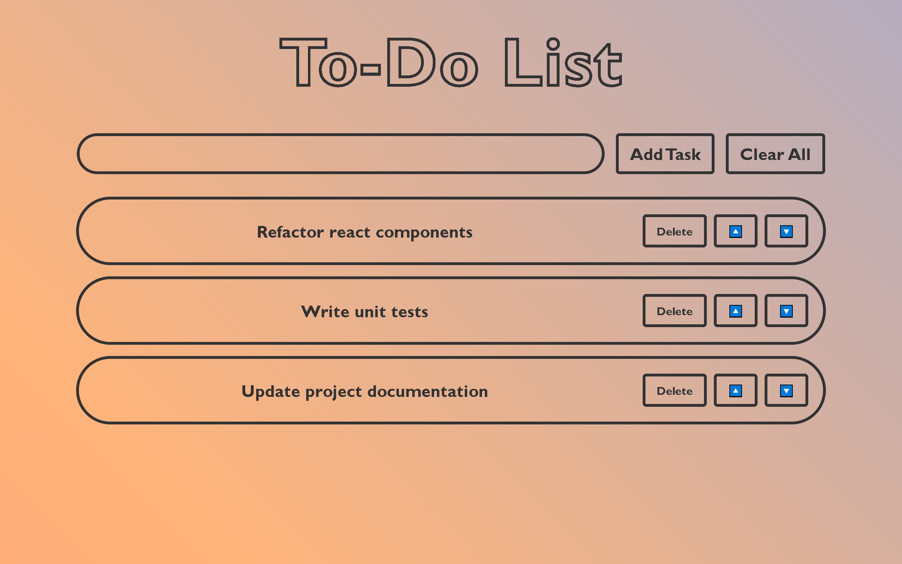
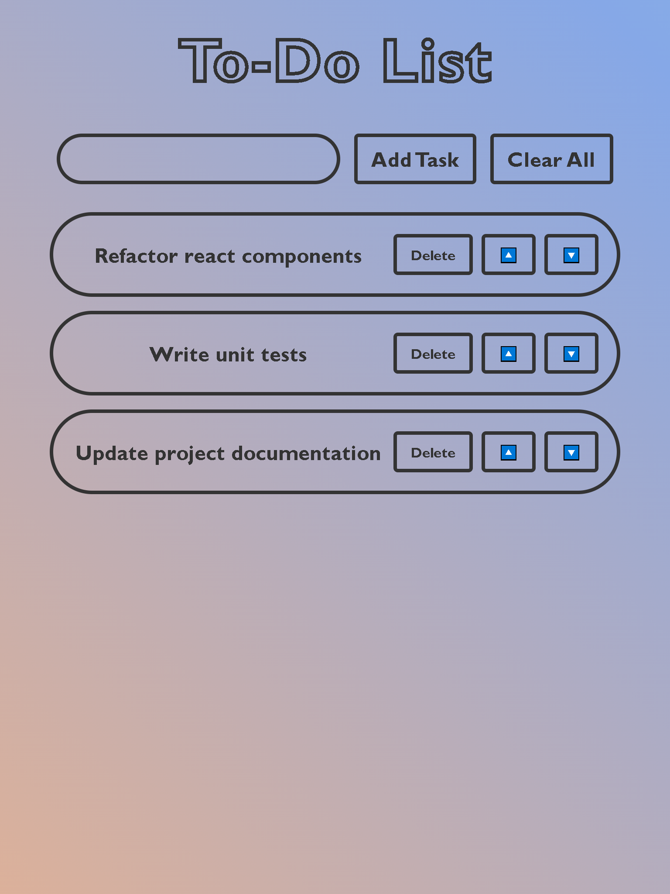
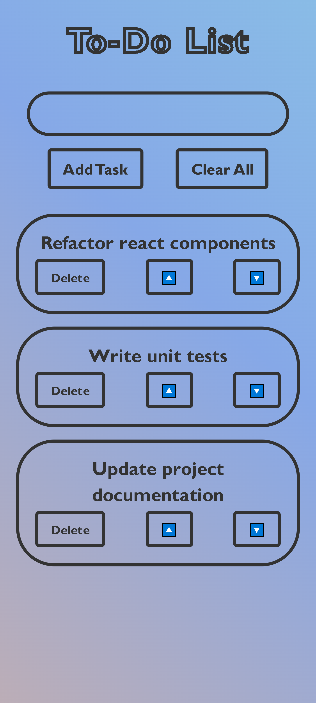

# TodoListApp - Simple React Todo List

TodoListApp is a lightweight, responsive React application for managing daily tasks. Users can add, delete, move, and clear tasks with an intuitive interface.

---

## Table of Contents

* [Features](#features)
* [Demo](#demo)
* [Tech Stack](#tech-stack)
* [Getting Started](#getting-started)

  * [Prerequisites](#prerequisites)
  * [Installation](#installation)
  * [Running Locally](#running-locally)
* [Usage](#usage)
* [Screenshots](#screenshots)
* [Contributing](#contributing)
* [License](#license)

---

## Features

* **Add Tasks:** Quickly create new todo items.
* **Delete Tasks:** Remove completed or unwanted tasks.
* **Move Tasks:** Reorder tasks via drag-and-drop.
* **Clear All:** Clear the entire list in one click.
* **Responsive Design:** Optimized for desktop and mobile.

---

## Demo

The application is hosted on GitHub Pages. Access the live demo here:
https://binil-dangol.github.io/To-Do-List/

---

## Tech Stack

* **Frontend:** React
* **Styling:** CSS Modules / Flexbox

---

## Getting Started

### Prerequisites

* [Node.js](https://nodejs.org/) v12 or above
* [npm](https://www.npmjs.com/) or [yarn](https://yarnpkg.com/)

### Installation

1. **Clone the repository**

   ```bash
   git clone https://github.com/Binil-Dangol/To-Do-List.git
   cd To-Do-List
   ```
2. **Install dependencies**

   ```bash
   npm install
   ```

### Running Locally

```bash
npm run dev
```

Open your browser at `http://localhost:5173` to view the app.

---

## Usage

1. **Add a Task:** Type into the input field and click the add button.
2. **Delete a Task:** Click the delete button next to a task.
3. **Move Tasks:** Click the up or down buttons to reorder.
4. **Clear All Tasks:** Click the "Clear All" button to remove all tasks.

---

## Screenshots





---

## Contributing

Feel free to fork the repo and submit Pull Requests. For major changes, please open an issue first to discuss your ideas.

---

## License

This project is open-source under the MIT License.
